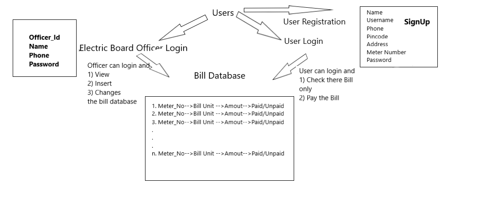

# Electricity Bill Management System

This project is the backend implementaiton of a electricity bill management system. Basically it has the REST API's and user has to hit these
API endpoints to perform any type of CRUD operation on database

> **Note:** This project does not have any frontend. The user has to hit the endpoints in POSTMAN, VS CODE THUNDER CLIENT or any other similar platform.

We have 3 collections in database
1) **Bill database** -> This is the main collection which contains the bills of all the meter numbers for each month. Only officer is allowed to enter,
update and delete the bill
2) **Officer Database** -> This is the collection of registed officers from the department. There is no endpoint to register officer that has to be done
by the department
3) **User Database** -> Contains the user's data along with there meter number. When any user registers himself his meter is registered but his bill is 
not created in Bill Database as that has to be entered by department officer.Only User can make entry to the collection and update the collection

**Image Description**

* The base URL is:  http://ebill-management-system.herokuapp.com/ 
* One has to hit this URL and this will return the JSON which describes all the endpoints to perform any operation.
* Short Description: There are two categories of endpoint, "base_url/user" and "base_url/officer". Both the user and officer can hit there respective
endpoints to perorm the desired action.

> **User functions**

* User register
* User Update
* User Check Bill
* User Pay Bill
* 
> Officer functions: 
> 
* Officer Bill entry
* Officer Bill Update
* Officer Bill Delete
* Officer User Delete
* Officer Check all Bills
* Officer Check all Users

